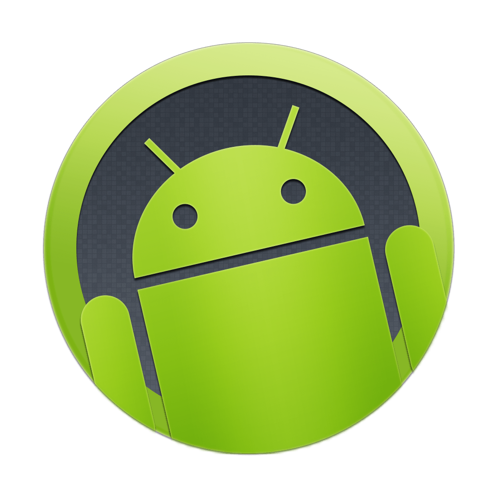

<div align="center">
  
  <h1>Android Device Control</h1>
  <p><strong>Comprehensive Android device control for AI agents</strong></p>
  <p>ADB + scrcpy H.264 vision streaming + fast input — 46 tools</p>

  [](https://www.npmjs.com/package/@ismail-kattakath/mcp-android)
  [](https://hub.docker.com/r/ismailkattakath/mcp-android)
  [](https://github.com/ismail-kattakath/mcp-android/actions/workflows/ci.yml)
  [](LICENSE)
  [](https://nodejs.org)
  [](https://modelcontextprotocol.io)
</div>

---

Give your AI agent full control over Android devices — take screenshots, tap and swipe, type text, stream live video, install APKs, read logcat, manage apps, and more. Works over USB or WiFi ADB, with or without scrcpy streaming.

## Features

- **46 MCP tools** across 11 categories — devices, vision, input, UI, apps, system, files, clipboard, notifications, screen control, WiFi ADB
- **Live H.264 vision streaming** via scrcpy standalone server + ffmpeg → JPEG resources at ~2 FPS
- **Fast input** via scrcpy control protocol (~5ms per event vs ~100–300ms for `adb shell input`)
- **Snapshot mode** — screenshot + UI dump work without scrcpy, no extra deps
- **WiFi ADB** — full enable → get-IP → connect → disconnect lifecycle

---

## Quick Start

### npx (no install required)

```bash
npx @ismail-kattakath/mcp-android
```

> Requires `adb` in your PATH: `brew install android-platform-tools` (macOS) or `sudo apt install adb` (Ubuntu/Debian).

### Docker (no Node.js required)

```bash
# macOS / Windows — delegate to host ADB daemon
docker run --rm -i \
  -e ADB_SERVER_HOST=host.docker.internal \
  ismailkattakath/mcp-android:latest

# Linux — same, but host.docker.internal needs --add-host
docker run --rm -i \
  --add-host=host.docker.internal:host-gateway \
  -e ADB_SERVER_HOST=host.docker.internal \
  ismailkattakath/mcp-android:latest

# USB-connected device (requires --privileged)
docker run --rm -i --privileged \
  -v /dev/bus/usb:/dev/bus/usb \
  ismailkattakath/mcp-android:latest
```

---

## MCP Client Setup

Choose your transport once and use the same config in any client.

### Option A — npx (recommended)

```json
{
  "mcpServers": {
    "mcp-android": {
      "command": "npx",
      "args": ["-y", "@ismail-kattakath/mcp-android"]
    }
  }
}
```

### Option B — Docker

```json
{
  "mcpServers": {
    "mcp-android": {
      "command": "docker",
      "args": [
        "run", "--rm", "-i",
        "-e", "ADB_SERVER_HOST=host.docker.internal",
        "ismailkattakath/mcp-android:latest"
      ]
    }
  }
}
```

> **Linux Docker users:** add `"--add-host=host.docker.internal:host-gateway"` before the `-e` flag.

### Where to put the config

| Client | Config file |
|--------|-------------|
| **Claude Desktop** | `~/Library/Application Support/Claude/claude_desktop_config.json` (macOS) · `%APPDATA%\Claude\claude_desktop_config.json` (Windows) |
| **Claude Code** | `.mcp.json` in your project root, or `claude mcp add mcp-android -- npx -y @ismail-kattakath/mcp-android` |
| **Cursor** | **Cursor Settings → MCP** config file |
| **VS Code / Cline** | `.vscode/cline_mcp_settings.json` |
| **VS Code / Continue** | `~/.continue/config.json` under `experimental.modelContextProtocolServers[].transport` |
| **Zed** | `settings.json` under `context_servers` |
| **Docker Desktop MCP Toolkit** | Search **Android Device Control** in the catalog, or `docker mcp profile server add <id> --server docker://ismailkattakath/mcp-android:latest` |

---

## Vision Streaming

Vision streaming requires the [scrcpy standalone server](https://github.com/Genymobile/scrcpy/releases) binary and `ffmpeg`.

```bash
# Download scrcpy server binary (example: v3.2)
wget https://github.com/Genymobile/scrcpy/releases/download/v3.2/scrcpy-server-v3.2 \
  -O /tmp/scrcpy-server
```

**npx:**
```bash
SCRCPY_SERVER_PATH=/tmp/scrcpy-server \
SCRCPY_SERVER_VERSION=3.2 \
npx @ismail-kattakath/mcp-android
```

**Docker:**
```bash
docker run --rm -i \
  -e ADB_SERVER_HOST=host.docker.internal \
  -e SCRCPY_SERVER_PATH=/opt/scrcpy-server \
  -e SCRCPY_SERVER_VERSION=3.2 \
  -v /tmp/scrcpy-server:/opt/scrcpy-server:ro \
  ismailkattakath/mcp-android:latest
```

Once started with `android.vision.startStream`, a live resource is registered at `android://device/<serial>/frame/latest.jpg`. Read it to get the latest JPEG frame. Fast input via the scrcpy control protocol (~5ms) is also enabled automatically.

---

## Tool Reference

### Device (2)
| Tool | Description |
|------|-------------|
| `android.devices.list` | List all connected devices (`adb devices -l`) |
| `android.devices.info` | Get device model, brand, SDK version via `getprop` |

### Vision (3)
| Tool | Description |
|------|-------------|
| `android.vision.startStream` | Start H.264 stream via scrcpy → JPEG resource; enables fast input |
| `android.vision.stopStream` | Stop stream and remove frame resource |
| `android.vision.snapshot` | Take PNG screenshot via `adb exec-out screencap -p` |

### Input (9)
| Tool | Description |
|------|-------------|
| `android.input.tap` | Tap at (x, y) — fast via scrcpy or `adb shell input` |
| `android.input.swipe` | Swipe from → to with duration |
| `android.input.text` | Type text (full UTF-8 via scrcpy, or `adb shell input text`) |
| `android.input.keyevent` | Send keycode (HOME=3, BACK=4, POWER=26, ENTER=66…) |
| `android.input.longPress` | Long press with duration |
| `android.input.pinch` | Pinch gesture (zoom in/out) |
| `android.input.dragDrop` | Drag and drop |
| `android.input.doubleTap` | Double tap at (x, y) with configurable interval — fast via scrcpy or adb |
| `android.input.scroll` | Scroll up/down/left/right — fast via scrcpy scroll protocol or adb swipe |

### UI Automation (2)
| Tool | Description |
|------|-------------|
| `android.ui.dump` | Dump full UI hierarchy XML via uiautomator |
| `android.ui.findElement` | Find elements by text, resource-id, class, or content-desc — returns center coordinates |

### Apps (7)
| Tool | Description |
|------|-------------|
| `android.app.start` | Launch app by package name (+ optional activity) |
| `android.app.stop` | Force-stop app |
| `android.app.install` | Install APK via `adb install -r` |
| `android.app.uninstall` | Uninstall app by package name; optional `-k` to keep data |
| `android.app.openUrl` | Open URL via `android.intent.action.VIEW` — supports https://, deep links, market:// |
| `android.apps.list` | List installed packages (all / system-only / third-party) |
| `android.activity.current` | Get currently focused package and activity |

### System (4)
| Tool | Description |
|------|-------------|
| `android.shell.exec` | Execute arbitrary shell command via `adb shell` |
| `android.system.logcat` | Capture logcat output (optional filter + line limit) |
| `android.system.activityManager` | Run `am` commands (start, broadcast, force-stop…) |
| `android.system.packageManager` | Run `pm` commands (list, grant, revoke, clear…) |

### Files (3)
| Tool | Description |
|------|-------------|
| `android.file.push` | Push local file to device |
| `android.file.pull` | Pull file from device to host |
| `android.file.list` | List directory contents (`ls -la`) |

### Clipboard (2)
| Tool | Description |
|------|-------------|
| `android.clipboard.get` | Get clipboard content via `dumpsys clipboard` |
| `android.clipboard.set` | Set clipboard content (restricted on Android 10+) |

### Notifications (1)
| Tool | Description |
|------|-------------|
| `android.notifications.get` | Dump all current notifications via `dumpsys notification` |

### Screen (9)
| Tool | Description |
|------|-------------|
| `android.screen.wake` | Wake screen (KEYCODE_WAKEUP) |
| `android.screen.sleep` | Put screen to sleep (KEYCODE_SLEEP) |
| `android.screen.isOn` | Check if screen is on |
| `android.screen.unlock` | Wake and unlock screen (no-PIN devices only) |
| `android.screen.getSize` | Get screen dimensions `{ width, height, physicalWidth, physicalHeight }` |
| `android.screen.getOrientation` | Get orientation: portrait/landscape/portrait_reverse/landscape_reverse + degrees |
| `android.screen.setOrientation` | Lock orientation or restore auto-rotation |
| `android.screen.startRecord` | Start `adb screenrecord` (MPEG-4/H.264); configurable bitrate, size, time limit |
| `android.screen.stopRecord` | Stop recording, finalize MP4, optionally pull to host |

### WiFi ADB (4)
| Tool | Description |
|------|-------------|
| `android.adb.connectWifi` | Connect to device over WiFi |
| `android.adb.disconnectWifi` | Disconnect WiFi ADB (one device or all) |
| `android.adb.enableTcpip` | Enable TCP/IP mode (USB required first) |
| `android.adb.getDeviceIp` | Get device WiFi IP address |

---

## Configuration

All options via environment variables:

| Variable | Default | Description |
|----------|---------|-------------|
| `ADB_PATH` | `adb` | Path to the `adb` binary |
| `FFMPEG_PATH` | `ffmpeg` | Path to the `ffmpeg` binary (vision streaming only) |
| `SCRCPY_SERVER_PATH` | — | Path to scrcpy-server binary (enables vision streaming) |
| `SCRCPY_SERVER_VERSION` | — | Version string matching the binary (e.g. `3.2`) |
| `ADB_SERVER_HOST` | — | ADB daemon host — set to `host.docker.internal` when running in Docker |
| `ADB_SERVER_PORT` | `5037` | ADB daemon port |
| `DEFAULT_MAX_SIZE` | `1024` | Max stream dimension in pixels |
| `DEFAULT_MAX_FPS` | `30` | Stream frame rate |
| `DEFAULT_FRAME_FPS` | `2` | JPEG extraction rate for MCP resources |
| `LOG_LEVEL` | `2` | `0`=silent · `1`=errors · `2`=info · `3`=debug |

---

## WiFi ADB Workflow

```
1. Connect device via USB
2. android.adb.enableTcpip   { serial: "USB_SERIAL", port: 5555 }
3. android.adb.getDeviceIp   { serial: "USB_SERIAL" }
   → { ipAddress: "192.168.1.42" }
4. Unplug USB
5. android.adb.connectWifi   { ipAddress: "192.168.1.42", port: 5555 }
6. Use "192.168.1.42:5555" as the serial for all subsequent tools
```

---

## Building from Source

```bash
git clone https://github.com/ismail-kattakath/mcp-android.git
cd mcp-android
npm install
npm run build
node dist/index.js        # or: npm start
```

```bash
# Docker
docker build -t mcp-android .
docker run --rm -i -e ADB_SERVER_HOST=host.docker.internal mcp-android
```

---

## Contributing

See [CONTRIBUTING.md](CONTRIBUTING.md). Bug fixes, new tools, and documentation improvements are all welcome.

## Credits

Built on top of two excellent open-source projects:

- [mcp-scrcpy-vision](https://github.com/invidtiv/mcp-scrcpy-vision) by invidtiv — scrcpy H.264 streaming + fast input
- [adb-mcp](https://github.com/srmorete/adb-mcp) by srmorete — ADB tool wrappers

## License

[MIT](LICENSE)
